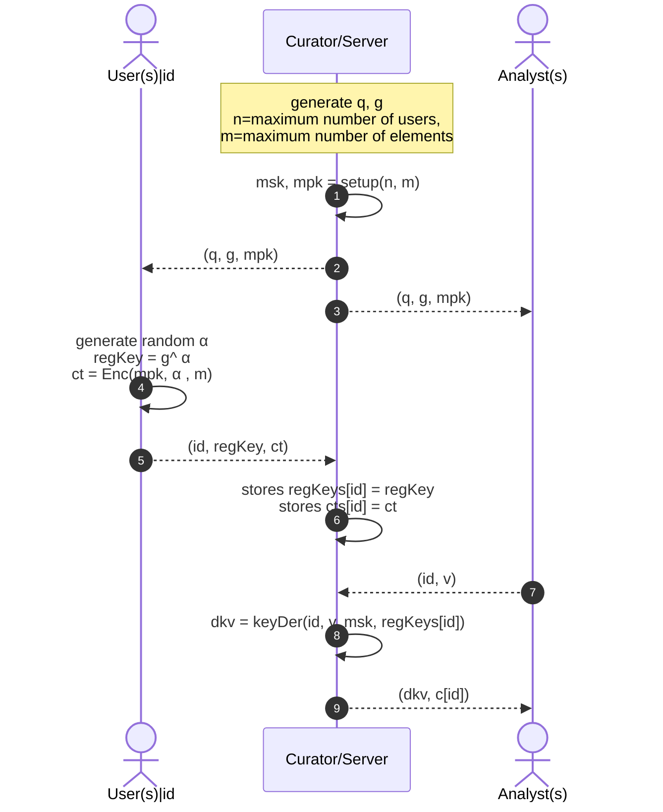

# SPADE

**SPADE**: Digging into **S**elective and **PA**rtial **DE**cryption using Functional Encryption

## Limitations

Curators should specify the number of users and the maximum number of entries for each user.
Users will encrypt their data as a vector of integers that cannot have **zero** values.

**Note:** Be careful when defining users' data vector using `make()`;
it assigns a **zero** to the elements when initializing them.

## Changing the protobuf structure

If you want to modify the protobuf structure first change the following file:

    ./spadeproto/spade.proto

and then run the proto compiler command to generate the new protobuf files:

    protoc --go_out=. --go-grpc_out=. spade.proto 

## Testing Instruction

## Benchmarking Instruction

    go test -benchtime=10x -bench=BenchmarkSpade -benchmem -run=^$

## Protocol Sequence Diagram

