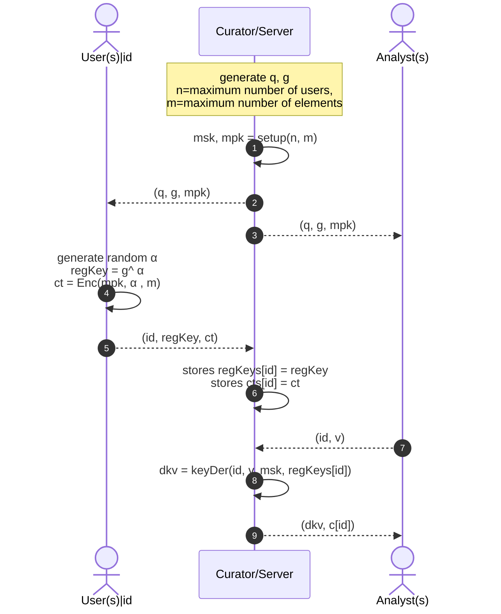

# Use Cases
```
|- usecases
|-- dna
|-- hypnogram
|-- models
```

The `use cases` demonstrate two practical applications of **SPADE** for DNA and hypnogram 
data. Besides, the `models` directory includes the entities' implementation for the centralized
system model. To implement the client-server model, we utilized standard gRPC and protocol buffer libraries.

**NOTE: To enable database management for use cases, we employed go-sqlite3, which requires gcc to be installed
beforehand. [Here](https://github.com/mattn/go-sqlite3?tab=readme-ov-file#installation), you can check the requirements
for go-sqlite3 installation.**

## System Model
```
|-- models
|--- analyst.go
|--- user.go
|--- server.go
|--- config.go
|--- handlers.go
```
Our experiments implemented a centralized system model involving three key entities: 
User, Server/Curator, and Analyst. The code for each entity contains a `Start...()` 
function where we set up the SPADE scheme and share the public parameters. The order 
of starting entities should be, as in real-life applications, starting by the server, then users, 
and analyst.
Furthermore, there are `config.go` and `handlers.go`, including general configuration structures, 
and handler functions for gRPC and SQLite, respectively.

## Use Case #1: Hypnogram Data
```
|-- hypnogram
|--- dataset
|--- app.go
|--- app_test.go
|--- config.go
```
We have a dataset of 590 files for the first use case, each including 1000 entries. The `app.go` 
contains the hypnogram application for initializing the server, users, and analyst by using 
the default configuration in `config.go` and calling each entity from `models`.
Note: to initialize users, we are reading all the files from the dataset by assuming each file 
represents a user.

To test the application and get the results, there is a `app_test` with different test functions, 
one for each entity, where you can run it by the following commands (please note that the order of
running them should be as it mentioned):

### Testing Instruction
move to the `hypnogram` directory by `$ cd usecases/hypnogram/`
1. Start the server
    `go test -run TestInitServer`
2. Start users
   `go test -run TestInitUsers`
3. Start analyst
   `go test -run TestInitAnalyst`

By running the mentioned test, the server will start listening to get requests from users and store 
the hypnogram ciphers locally in an SQLite database. Later, by receiving the analyst's request, the 
server will send him decryption keys along with the user's cipher. The analyst, by receiving the keys
and ciphers, will be able to partially decrypt the cipher and get the results.

## Use Case #2: DNA sequences
```
|-- dna
|--- dataset
|--- app.go
|--- app_test.go
|--- config.go
```
We have a dataset of 5012 files for the first use case, each including 78214 entries. The `app.go`
contains the DNA application for initializing the server, users, and analyst by using
the default configuration in `config.go` and calling each entity from `models`.
Note: to initialize users, we are reading all the files from the dataset by assuming each file
represents a user.

To test the application and get the results, there is a `app_test` with different test functions,
one for each entity, where you can run it by the following commands (please note that the order of
running them should be as it mentioned):

### Testing Instruction
move to the `dna` directory by `$ cd usecases/dna/`
1. Start the server
   `go test -run TestInitServer`
2. Start users
   `go test -run TestInitUsers`
3. Start analyst
   `go test -run TestInitAnalyst`


By running the mentioned test, the server will start listening to get requests from users and store
the hypnogram ciphers locally in an SQLite database. Later, by receiving the analyst's request, the
server will send him decryption keys along with the user's cipher. The analyst, by receiving the keys
and ciphers, will be able to partially decrypt the cipher and get the results.

## Protocol Sequence Diagram

