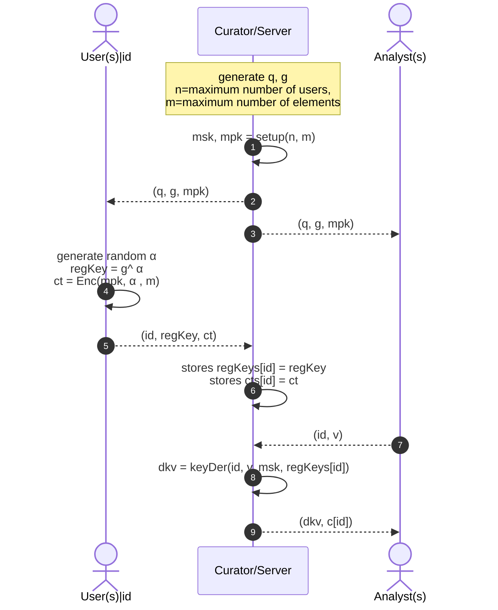

# Hypnogram Data Use Case

The `usecases` demonstrates a practical application of **SPADE** for hypnogram data.
The dataset comprises hypnogram data files and is utilized within a model involving
three key entities: Users, Server/Curator, and Analysts. To implement the client-server
model, we utilized standard gRPC and protocol buffer libraries.

## System Model

## Protocol Sequence Diagram

